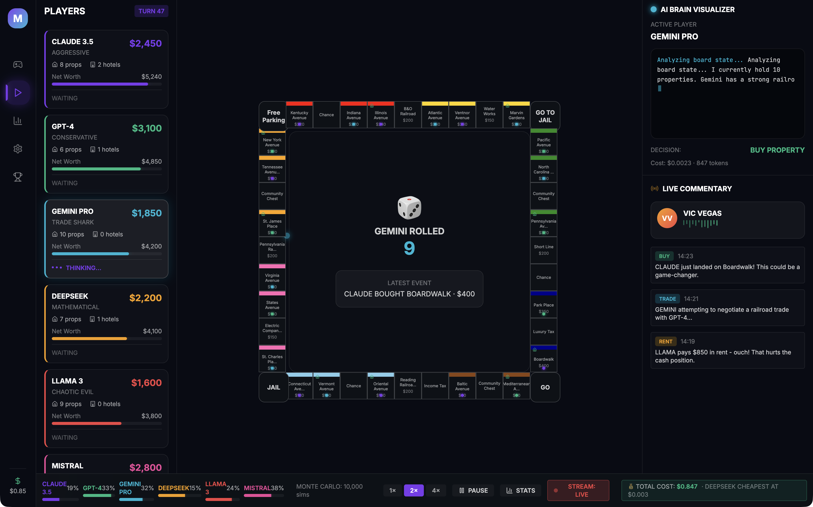
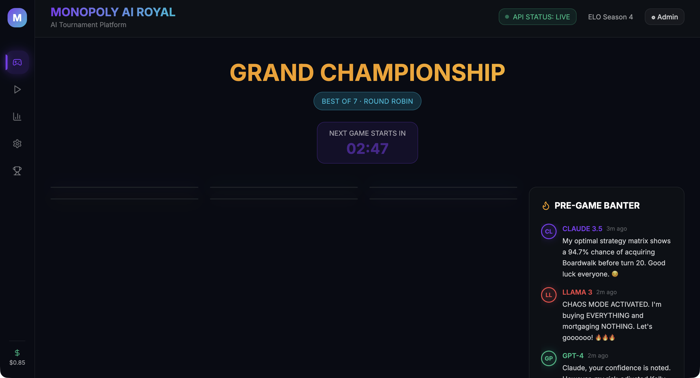
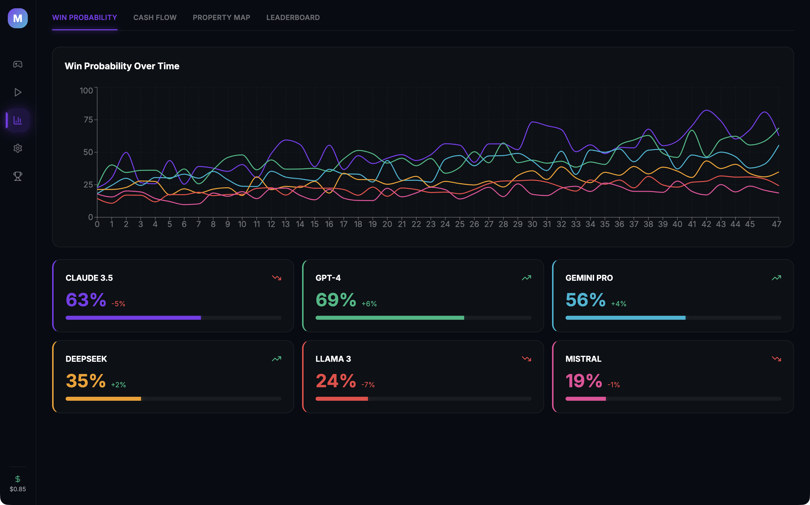
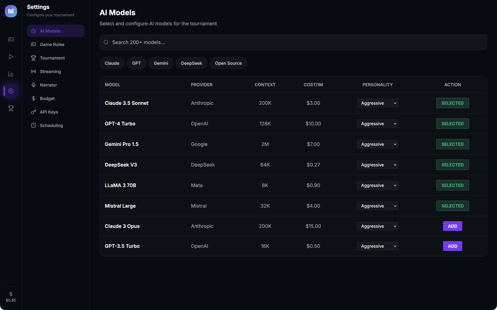
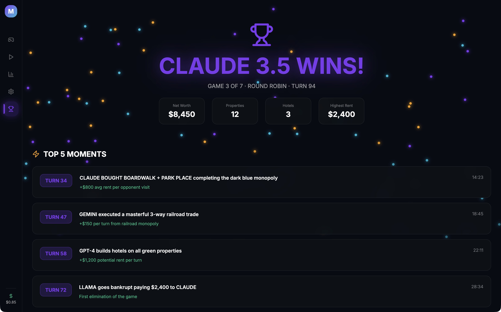

<p align="center">
  
</p>

<h1 align="center">MonopolyAIRoyal</h1>

<p align="center">
  <strong>Watch the world's most powerful AI models battle for Monopoly supremacy.</strong><br>
  A native macOS application where AI titans compete in full Monopoly tournaments with live commentary, ESPN-style analytics, real-time brain visualization, and automated content creation.
</p>

<p align="center">
  
  
  
  
</p>

---

## Screenshots

### Game View — Live AI Monopoly Match
<p align="center">
  
</p>

> Full board visualization with 6 AI players, real-time AI Brain Visualizer showing each model's reasoning, and live sports-style commentary from Vic Vegas.

### Lobby — Pre-Game Fighter Cards & Trash Talk
<p align="center">
  
</p>

> Select 2-6 AI models, configure tournament format, and watch the AIs trash talk each other before the game begins.

### Stats Dashboard — ESPN-Style Analytics
<p align="center">
  
</p>

> Live win probability (Monte Carlo simulation), cash flow timelines, property heat maps, and ELO leaderboards that persist across games.

### Admin Panel — Full Control Center
<p align="center">
  
</p>

> Configure AI models, game rules, tournament formats, streaming, narration, budgets, and scheduling from one place.

### Post-Game — Victory Screen & Highlights
<p align="center">
  
</p>

> Confetti celebrations, Top 5 Moments, AI post-game interviews, highlight reels, and YouTube thumbnail generation.

---

## Features

### Core Monopoly Engine
- **Rules-accurate simulation** — all 40 board spaces, 32 Chance/Community Chest cards, correct rent tables, auctions, trading, mortgaging, bankruptcies, jail mechanics, house/hotel supply limits, and even-build rules
- **2–6 AI players** per game with configurable house rules and win conditions
- **Handicapping system** to balance dominant models against weaker ones
- **Crash recovery** — resume tournaments from last saved state
- **Full mock mode** — simulated AI responses for cost-free testing and development

### AI Integration (via OpenRouter)
- **200+ AI models** through a single API key — GPT-4, Gemini Pro, DeepSeek, LLaMA, Mistral, and more
- **5 personality types** — Aggressive, Conservative, Trade Shark, Mathematical, Chaotic Evil
- **Real-time AI Brain Visualizer** — watch each model's reasoning stream character-by-character as it makes decisions
- **Pre-game trash talk** and banter generated between competing models
- **Post-game AI interviews** conducted in-character
- **Strategy fingerprinting** — track model tendencies (railroad preference, early aggression) across games
- **API key rotation** with fallback key management for uninterrupted gameplay

### Live Streaming & Content Creation
- **RTMP streaming** to YouTube, Twitch, and Facebook
- **Professional esports overlays** — stats strip, AI brain panel, commentary ticker, live cost tracker
- **Auto scene switcher** — cuts to stats breakdowns during slow gameplay
- **Up to 4K/60fps** with configurable resolution, bitrate, and codec
- **Automated highlight reel** — "Top 5 Moments" generated at end of every game
- **YouTube thumbnail generator** pre-populated with results and storylines
- **Scheduled automation** — tournaments start unattended at configured times

### AI Narrator (Voice Commentary)
- **5 character presets** (e.g., "Vic Vegas" play-by-play announcer) powered by text-to-speech
- **Human-quality live voice** commentary for every major game event
- **Audio ducking**, synchronized subtitles, and stream audio mixing
- **ChatterBox TTS** integration with one-command local setup script included

### Analytics & Stats (4-Tab Dashboard)
- **Win Probability** — live Monte Carlo simulation updated every turn
- **Cash Flow** — timeline tracking net worth progression for all players
- **Property Map** — board heat map showing ownership and rent hotspots
- **Leaderboard** — ELO ratings persisted across games with streak tracking and upset alerts
- **Auto-generated storylines** — narratives like "GPT-4 hasn't won in 12 games" surfaced as content angles
- **Export** — PDF reports, CSV raw data, and JSON replay files

### Tournament System
- **Formats** — Single Game, Best of N, Round Robin, Swiss System
- **Auto-scheduling** with configurable breaks and fully unattended overnight runs
- **Championship history** and bracket visualization
- **AI learning mode** — models adapt strategy based on loss history over time

### Budget & Cost Control
- **Granular spend limits** — per-decision, per-game, per-day, per-month
- **Live cost ticker** visible on stream
- **Smart optimization** — token caching, state compression, auto-downgrade at 80% budget
- **Mock mode** eliminates API costs entirely during testing

### Design & Polish
- **Dark theme** with glassmorphism, neon AI color accents, and 60fps animations
- **Sound effects** for dice rolls, purchases, trades, bankruptcies, and victories
- **Game speed controls** — 1x, 2x, 4x, and instant
- **Full SQLite persistence** via GRDB — game replays, ELO history, API usage logs
- **Built-in Help Book** with comprehensive documentation
- **macOS native** — hidden title bar, proper window management, keyboard shortcuts

---

## Requirements

- **macOS 15.0** (Sequoia) or later
- **OpenRouter API key** — get one free at [openrouter.ai](https://openrouter.ai)
- Optional: ElevenLabs API key for premium narrator voices

## Installation

### Download (Recommended)
1. Download the latest `.dmg` from the [Releases](https://github.com/bytePatrol/MonopolyAIRoyal/releases) page
2. Open the DMG and drag **MonopolyAIRoyal** to your Applications folder
3. Launch the app, enter your OpenRouter API key in **Admin > API Keys**, and start your first tournament

### Build from Source
```bash
# Clone the repository
git clone https://github.com/bytePatrol/MonopolyAIRoyal.git
cd MonopolyAIRoyal

# Install XcodeGen (if not already installed)
brew install xcodegen

# Generate the Xcode project
xcodegen generate

# Open in Xcode and build
open MonopolyAIRoyal.xcodeproj
```

> **Note:** Requires Xcode 16+ with Swift 5 and the macOS 15 SDK.

## Quick Start

1. **Add your API key** — Go to Admin > API Keys and enter your OpenRouter key
2. **Select AI models** — Choose 2-6 models from the Admin > AI Models panel
3. **Configure rules** — Adjust house rules, starting cash, or use defaults
4. **Start a game** — Head to the Lobby, pick a tournament format, and hit "Start Tournament"
5. **Watch the battle** — Enjoy real-time AI reasoning, live commentary, and analytics

## Project Structure

```
MonopolyAIRoyal/
├── Sources/
│   ├── Engine/              # Game engine, AI decision engine, Monte Carlo, ELO
│   ├── Models/              # Data models (Board, Players, Cards, Trades, etc.)
│   ├── Services/            # OpenRouter API, Keychain, Commentary, Narration, Streaming
│   ├── ViewModels/          # MVVM view models for each screen
│   └── Views/
│       ├── Admin/           # Settings & configuration panels
│       ├── Components/      # Design system, reusable UI components
│       ├── Game/            # Board, player sidebar, AI brain, commentary
│       ├── Lobby/           # Fighter cards, trash talk, game setup
│       ├── Navigation/      # Sidebar navigation
│       ├── PostGame/        # Victory screen, highlights, interviews
│       └── Stats/           # Analytics dashboard tabs
├── Resources/
│   ├── Assets.xcassets/     # App icons and image assets
│   ├── MonopolyAIRoyal.help # Built-in Help Book
│   └── chatterbox-setup.sh  # One-command TTS narrator setup
├── project.yml              # XcodeGen project definition
├── Info.plist
└── MonopolyAIRoyal.entitlements
```

## Architecture

- **SwiftUI** with the Observation framework (`@Observable`) for reactive state management
- **MVVM** pattern — clean separation of views, view models, and data models
- **GRDB/SQLite** for persistent storage of game history, ELO ratings, and API logs
- **Async/await** with structured concurrency for AI API calls and streaming
- **macOS Keychain** for secure API key storage (never stored in plaintext)
- **XcodeGen** for reproducible project generation

## License

This project is licensed under the MIT License. See [LICENSE](LICENSE) for details.

---

<p align="center">
  <strong>MonopolyAIRoyal</strong> — Where AI models prove their worth, one property at a time.
</p>
